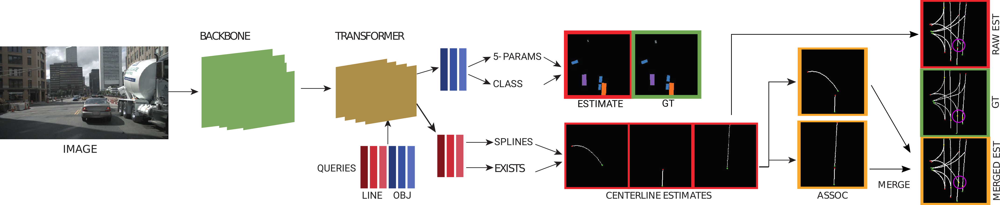

Official code for "Structured Bird’s-Eye-View Traffic Scene Understanding from Onboard Images" (ICCV 2021)



In this work, we study the problem of extracting a directed graph representing the local road network in BEV coordinates, from a single onboard camera image. Moreover, we show that the method can be extended to detect dynamic objects on the BEV plane. The semantics, locations, and orientations of the detected objects together with the road graph facilitates a comprehensive understanding of the scene.


[Link to paper](https://arxiv.org/pdf/2110.01997.pdf)

We provide support for Nuscenes and Argoverse datasets. 

Check out our extension paper

TPLR (CVPR'22): [https://github.com/ybarancan/TopologicalLaneGraph](https://github.com/ybarancan/TopologicalLaneGraph)

Monocular video based BEV segmentation:

BEVFeatStitch (ICRA/RAL'22): [https://github.com/ybarancan/BEV_feat_stitch](https://github.com/ybarancan/BEV_feat_stitch)

## Steps
0. Make sure you have installed Nuscenes and/or Argoverse devkits and datasets installed
1. In configs/deafults.yml file, set the paths
2. Run the make_labels.py file for the dataset you want to use
3. If you want to use zoom augmentation (only for Nuscenes currently), run src/data/nuscenes/sampling_grid_maker.py (Set the path to save the .npy file in the sampling_grid_maker.py)
4. You can use train_tr.py for training the transformer based model or train_prnn.py to train the Polygon-RNN based model
5. We recommend using the Cityscapes pretrained Deeplab model (link provided below) as backbone for training your own model
6. Validator files can be used for testing. The link to trained models are given below.


## Trained Models

Cityscapes trained Deeplabv3 model is at:  https://data.vision.ee.ethz.ch/cany/STSU/deeplab.pth

Nuscenes trained Polygon-RNN based model is at:  https://data.vision.ee.ethz.ch/cany/STSU/prnn.pth

Nuscenes trained Transformer based model is at:  https://data.vision.ee.ethz.ch/cany/STSU/transformer.pth

## Metrics

The implementation of the metrics can be found in src/utils/confusion.py.
Please refer to the paper for explanations on the metrics.


## Additional Results

The method's results without object supervision:

| Metric/Dataset | Nuscenes | Argoverse |
| -------- | ------------- | ------------- |
| M-F  | 56.7  | 55.6  |
| Detection  | 59.9  |60.1  |
| Assoc C-F  | 55.2  | 54.9 |

### Additional Links

- Polygon-RNN: https://github.com/fidler-lab/polyrnn-pp
- DETR: https://github.com/facebookresearch/detr
- PINET: https://github.com/koyeongmin/PINet_new
- PON: https://github.com/tom-roddick/mono-semantic-maps


## Expected Folder structure
```
(CV) ➜ ~/Personal/lss tree nuscenes -L 2
nuscenes
├── mini
│   ├── maps
│   ├── samples
│   ├── sweeps
│   └── v1.0-mini
└── trainval
    ├── maps
    ├── samples
    └── v1.0-trainval

9 directories, 0 files
(CV) ➜ ~/Personal/lss tree nuscenes/mini/v1.0-mini -L 2
nuscenes/mini/v1.0-mini
├── attribute.json
├── calibrated_sensor.json
├── category.json
├── ego_pose.json
├── instance.json
├── log.json
├── map.json
├── sample_annotation.json
├── sample_data.json
├── sample.json
├── scene.json
├── sensor.json
└── visibility.json

0 directories, 13 files
(CV) ➜ ~/Personal/lss tree nuscenes/mini/v1.0-mini -L 2
(CV) ➜ ~/Personal/lss lt nuscenes/mini/maps/
total 5.6M
drwxr-xr-x 2 ramu ramu 4.0K Nov 23  2020 expansion
-rw-r--r-- 1 ramu ramu 1.8M Mar 22  2019 93406b464a165eaba6d9de76ca09f5da.png
-rw-r--r-- 1 ramu ramu 1.1M Mar 22  2019 53992ee3023e5494b90c316c183be829.png
-rw-r--r-- 1 ramu ramu 1.4M Mar 22  2019 37819e65e09e5547b8a3ceaefba56bb2.png
-rw-r--r-- 1 ramu ramu 1.5M Mar 22  2019 36092f0b03a857c6a3403e25b4b7aab3.png
(CV) ➜ ~/Personal/lss lt nuscenes/mini/maps/expansion
total 47M
-rwxrwxr-x 1 ramu ramu  16M Nov 19  2020 boston-seaport.json
-rwxrwxr-x 1 ramu ramu  14M Nov 19  2020 singapore-onenorth.json
-rw-rw-r-- 1 ramu ramu 7.9M Nov 23  2020 singapore-hollandvillage.json
-rw-rw-r-- 1 ramu ramu  11M Nov 23  2020 singapore-queenstown.json
```
